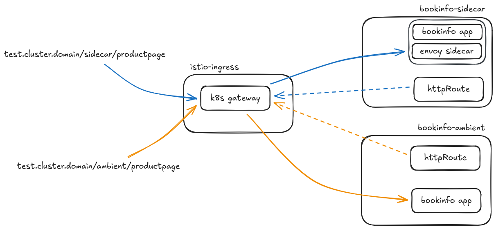
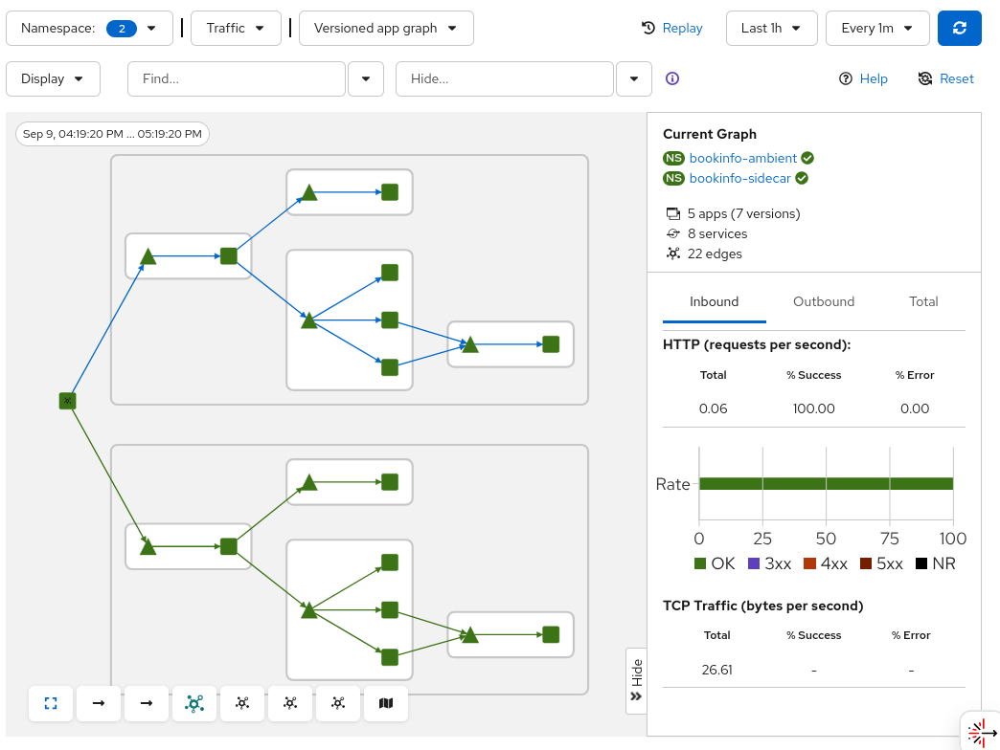

:icons: font
:source-highlighter: highlightjs
:highlightjs-theme: monokai
//:source-highlighter: rouge
:sectnums:
:toc:
:toclevels: 4

image:https://img.shields.io/badge/GitOps-Argo%20CD-blue?logo=argo[Argo CD]

== ToDo
* Desplegar el waypoint proxy

== Service mesh 3
Despliegue de service mesh 3 usando:

* Kubernetes api gateway
* Ambient mode
* Sidecars

Se despliega la aplicación bookinfo en 2 namespaces:

* *bookinfo-sidecar*, usando envoy
* *bookinfo-ambient*, sin usar sidecars

[NOTE]
Kubernetes Gateway API viene incluída (y soportada) por defecto desde OpenShift 4.19. En versiones anteriores puede o no estár instalada y no está soportada oficialmente porque es la versión de comunidad

Pasos para desplegar service mesh 3 y la aplicación:

* Instalar los operadores
* Desplegar el control plane
* Añadir los namespaces que van a ser gestionados por Istio
* Desplegar la aplicación *bookinfo* en los dos namespaces
* Crear y configurar los objetos HTTPRoute para acceder a la aplicación *bookinfo* en ambos namespaces
* Desplegar los componentes de observabilidad

=== Diferencias con Istio API
* Ingress gateway: ya no creamos el ingress mediante un deployment sino que desplegamos un objeto de tipo *Gateway* usando el api *gateway.networking.k8s.io*

* Los virtual service son reemplazados por el objeto *HTTPRoute* (o GRPCRoute). Existen otros objetos que gestionan rutas (TCPRoute, TLSRoute y UDPRoute pero de momento son experimentales)

* Los demás recursos de Istio son aplicables (destination rule, service entry...)

[NOTE]
Los virtual services todavía están soportados en service mesh 3 pero la recomendación es cambiarlos por HTTPRoute. Existe una https://github.com/kubernetes-sigs/ingress2gateway[herramienta] para automatizar esta conversión 

Las peticiones que incluyan el prefijo */sidecar* serán enviadas al pod que usa el sidecar y las peticiones que incluyan el prefijo */ambien* serán enviadas al pod que está configurado para usar ambient

=== Instalación
==== Instalación de los operadores

[cols="1,1"]
|===
| Operador | ArgoCD manifest

| Service mesh 3 
| *__01-service-mesh-3-operator.yaml__*

| Kiali
| *__02-kiali-operator.yaml__*

| OpenTelemetry
| *__03-otel-operator.yaml__*

| Grafana Tempo
| *__04-tempo-operator.yaml__*

| Cluster observability operator
| *__05-cluster-observability-operator.yaml__*
|===

[NOTE]
Si hemos instalado y desinstalado service mesh 2 previamente y la instalación del operador de service mesh 3 se queda parada tenemos que borrar todos los crd de sailoperator previos

==== Despliegue del control plane
Desplegamos el manifest *__06-control-plane.yaml__* de ArgoCD. Esto creará los objetos:

* *Istio* en el namespace istio-system
* *IstioCNI*, en el namespace istio-cni
* *IstioRevision*, que será creado automáticamente en el namespace istio-system
* *ZTunnel*, en el namespace ztunnel
* *ZTunnel pod monitor*

=== Desplegar la aplicación 'bookinfo'
Desplegamos el manifest *__07-bookinginfo-application.yaml__* que despliega la aplicación *bookinfo* en dos namespaces:

* *bookinfo-sidecar*, etiquetado para usar sidecars
+
[source, yaml]
----
  labels:
    istio-discovery: enabled
    istio-injection: enabled
----

* *bookinfo-ambient* etiquetado para usar ambient mode
+
[source, yaml]
----
  labels:
    istio-discovery: enabled
    istio.io/dataplane-mode: ambient
----

[WARNING]
====
Si el objeto Istio no se llama *default* las anotaciones añadidas al namespace no van a funcionar. Si le hemos cambiado el nombre en lugar de usar la label *__istio-injection=enabled__* en el namespace donde queremos inyectar los sidecar tenemos que usar esta otra:
[source, java]
----
istio.io/rev=<nombre_cr_istio>
----
====

=== Crear y configurar un gateway
Creamos el ingress gateway usando el api *gateway.networking.k8s.io* aplicando el manifest *__08-istio-ingress-gateway.yaml__*:

* Crea el namespace *istio-ingress*
* Despliega un objeto de tipo gateway usando api de kuberntes gateway API. Se crea automáticamente un servicio para acceder al gateway desplegado
* Crea una ruta para hacer pruebas con el gateway. La ruta tiene el formato: 
+
----
http://bookinfo.<cluster-hostname>
----

[IMPORTANT]
Debemos de usar *istio* como gatewayClassName para que istio sea capaz de gestionar el gateway que hemos creado

Creamos los HTTPRoute en ambos namespaces aplicando el manifest *__09-bookinfo-httproute.yaml__*

Comprobamos que podemos acceder a la aplicación usando la ruta que creamos para el ingress:
[source, bash]
----
# Versión con sidecar
curl -sk http://bookinfo.<cluster-hostname>/sidecar/api/v1/products | jq

# Versión con ambient
curl -sk http://bookinfo.<cluster-hostname>/ambient/api/v1/products | jq
----

[IMPORTANT]
[TODO] Parece que los virtual service sólo son válidos para el tráfico dentro la mesh, no van a funcionar con un ingress gateway <- revisar esto, de momento no me han funcionado los vs

== Observabilidad
Aplicamos manifest de argo *__10-observability.yaml__*, que:

* Crea una instancia de Kiali
* Crea un colector OpenTelemetry para recopilar trazas y métricas
* Crea una instancia de TempoStack para almacenar los datos recopilados por el colector OpenTelemetry
* Instala el plugin de monitorización para consulta los datos almacenados en tempo desde la consola de ocp

El siguiente diagrama muestra cómo se relacionan los componentes de observabilidad:

image::images/sm3-otel-tempo.excalidraw.png[]

Una vez desplegada la aplicación argo lanzamos el script *utils/generate-traffic.sh* para generar tráfico y comprobamos que podemos verlo en Kiali:

[IMPORTANT]
La configuración de TempoStack desplegada se ha configurado para usar un servidor http://min.io[min.io]. La configuración asociada está en el chart de *TempoStack* (directorio *observability*)

Dudas::
* Dónde estoy configurando la autorización para la conexión entre el colector y tempo? <- en tempostack?
* Añadir el crd de la consola de sm (kiali)
* Qué hay que hacer para que aparezca la pestaña de traces en los deployments? <- creo que es suficiente con añadir la propiedad *spec.external_services.tracing* al crd de kiali (y también aparecerán en el gráfico de kiali al picar en los elementos que aparecen)

