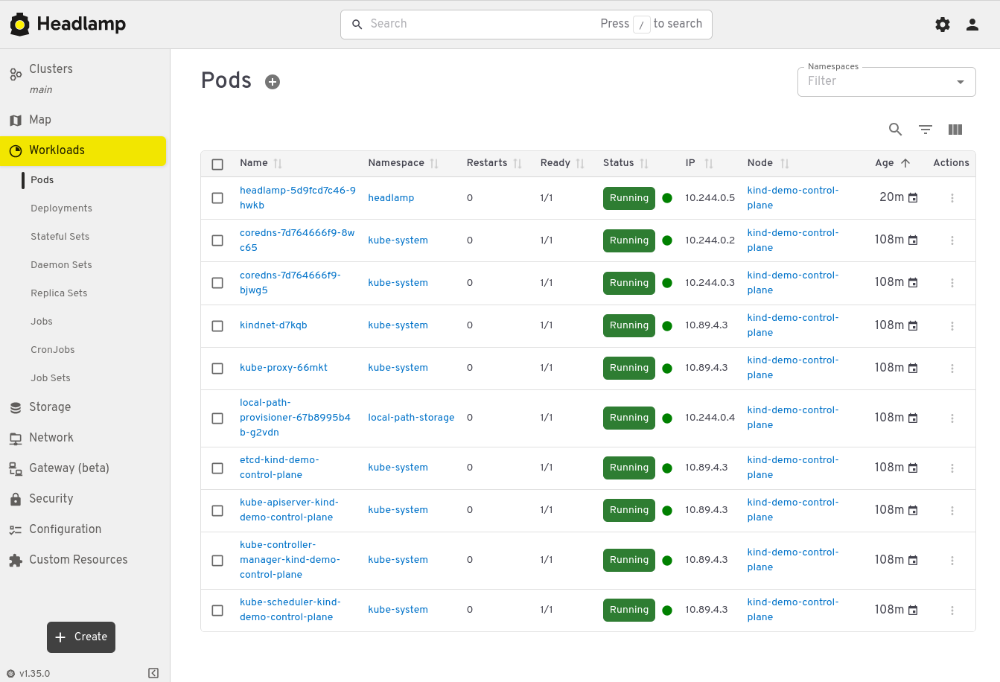

== Descripción
Creación de un cluster kubernetes e istio usando kind

Es necesario tener instaladas las siguientes aplicaciones:

* Kubectl
* Helm

== TODO
* Añadir espera al despliegue de headlamp hasta que el pod esté disponible
* Añadir un nombre de host al gateway y al vs

== Contenido
Scripts:

* *environment:* datos usados para crear el cluster
* *create-cluster.sh:* levanta el cluster kind usando los datos que hay en el fichero *environment*
* *headlamp:* scripts para desplegar https://headlamp.dev/[Headlamp], una consola web para gestionar el cluster

El acceso a la consola web de headlamp se hace a traves un gateway istio accesible desde el puerto 9080

[NOTE]
El fichero *environment* incluye la variable de entorno *KIND_EXPERIMENTAL_PROVIDER* para usar podmsn en lugar de docker. Si usas docker comenta esta variable.

== Uso
=== Desplegar un cluster kind
Pasos:

* Editamos el fichero *environment* para establecer los datos del cluster 
* Ejecutamos el script *create-cluster.sh*

Si queremos eliminar el cluster podemos hacerlo con el script *destroy-cluster.sh*

[NOTE]
====
El script de creación del cluster modificará temporalmente el número de ficheros abiertos en el host (a veces kind da problemas con esto). Este cambio desaparecerá al reiniciar el host. 

Esta es la configuración que se aplica:
[source, bash]
----
sudo sysctl fs.inotify.max_user_watches=524288
sudo sysctl fs.inotify.max_user_instances=512
sudo sysctl fs.file-max=100000
----
====

==== Funcionamiento del script 'create-cluster.sh'
Estas son las operaciones que ejecuta:

* Creación del fichero de configuración, a partir del fichero *kind-config.yaml.template*. Este proceso se procesa para añadir el nodeport que usa el servicio del ingress gateway y mapearlo a un puerto del host. Este puerto se configura en el fichero *environment* 

* Creación del cluster kind, usando el fichero *kind-config.yaml* creado a partir de la template del paso anterior. El proceso de creación del cluster se parará hasta que todos los pods estén levantados

* Una vez los pods del cluster están levantados se instala istio

* Una vez instalado istio se parchea el servicio del ingress gateway para asegurarnos de que el nodeport que usa es siempre el mismo (el indicado en el fichero *environment*)

=== Desplegar Headlamp
Headlamp se puede usar como una aplicación de escritorio o se puede desplegar en un cluster kubernetes. 

Para desplegarlo dentro del cluster usamos los scripts que están en el directorio *headlamp*:

* *01-install.sh:* crea el namespace *headlamp*, lo etiqueta para que istiod inyecte el sidecar y despliega el pod de headlamp

* *02-crear-sa.sh:* crea una service account con permisos administrativos. Esta sa nos servirá para obtener el token de acceso a la consola de headlamp

* *03-configurar-gateway.sh:* crea el gateway y el virtual service para acceder a la consola desde el host

* *04-get-token.sh:* genera un token de acceso que usaremos para hacer login en la consola de headlamp

Una vez ejecutados los scripts 01, 02 y 03 podemos abrir la consola web en *http://localhost:9080*. Ejecutamos el script 04 para obtener el token y accedemos:

