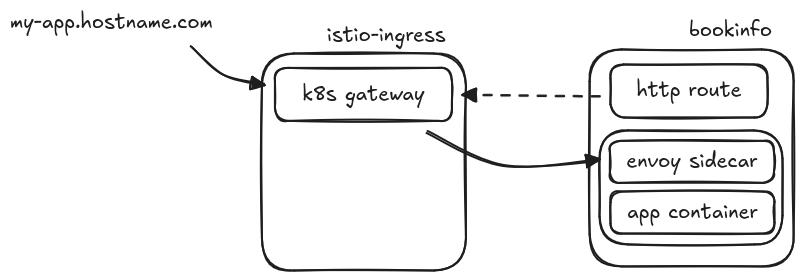
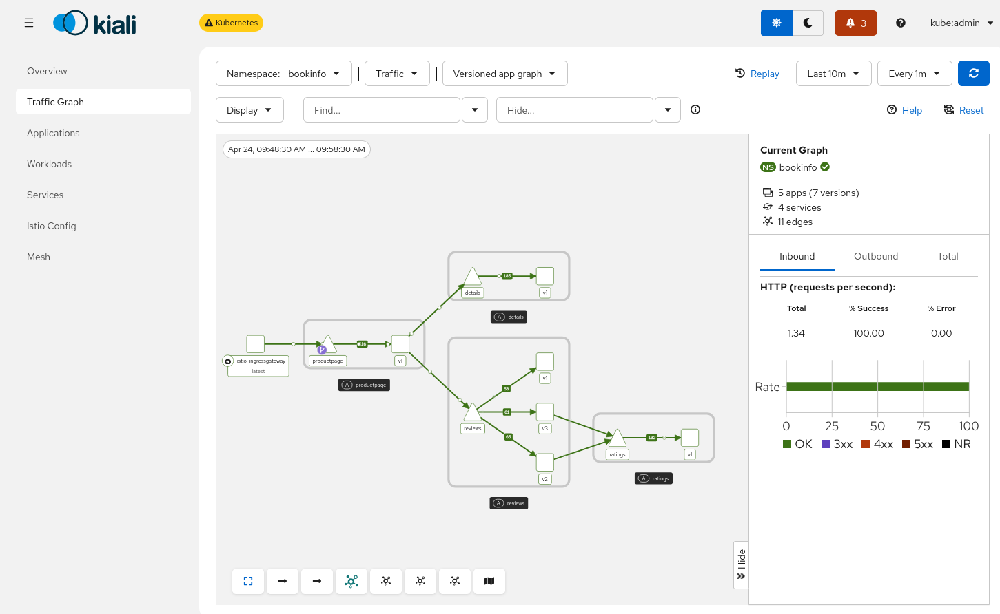

:icons: font
:source-highlighter: highlightjs
:highlightjs-theme: monokai
//:source-highlighter: rouge
:sectnums:
:toc:
:toclevels: 4

== Service mesh 3
Despliegue de service mesh 3 usando https://kubernetes.io/docs/concepts/services-networking/gateway/[Kubernetes Gateway API]

[NOTE]
Kubernetes Gateway API viene incluída (y soportada) por defecto desde OpenShift 4.19. En versiones anteriores puede o no está instalada y no está soportada oficialmente porque es la versión de comunidad

Pasos para desplegar service mesh 3 y la aplicación:

* Instalar los operadores
* Desplegar el control plane
* Añadir los namespaces que van a ser gestionados por Istio
* Desplegar la aplicación *bookinfo*
* Crear y configurar un gateway para acceder a la aplicación *bookinfo*

=== Diferencias con Istio API
* Ingress gateway: ya no creamos el ingress mediante un deployment sino que desplegamos un objeto de tipo *Gateway* usando el api *gateway.networking.k8s.io*

* Los virtual service son reemplazados por el objeto *HTTPRoute* (o GRPCRoute). Existen otros objetos que gestionan rutas (TCPRoute, TLSRoute y UDPRoute pero de momento son experimentales)

* Los demás recursos de Istio son aplicables (destination rule, service entry...)

[NOTE]
Los virtual services todavía están soportados en service mesh 3 pero la recomendación es cambiarlos por HTTPRoute. Existe una https://github.com/kubernetes-sigs/ingress2gateway[herramienta] para automatizar esta conversión 

=== Instalación
==== Instalación de los operadores

[cols="1,1"]
|===
| Operador | ArgoCD manifest

| Service mesh 3 
| *__01-service-mesh-3-operator.yaml__*

| Kiali
| *__02-kiali-operator.yaml__*

| OpenTelemetry
| *__03-otel-operator.yaml__*

|===

[NOTE]
Si hemos instalado y desinstalado service mesh 2 previamente y la instalación del operador de service mesh 3 se queda parada tenemos que borrar todos los crd de sailoperator previos

==== Despliegue del control plane
Desplegamos el manifest *__04-control-plane.yaml__* de ArgoCD. Esto creará los objetos *Istio* (en el namespace istio-system) e *IstioCNI* (en el namespace istio-cni). Además se creará automáticamente el objeto *IstioRevision* (en el namespace istio-system)

=== Desplegar la aplicación 'bookinfo'
Desplegamos el manifest *__05-bookinginfo-application.yaml__* que:

* Crea el namespace *bookinfo* y le añade las anotaciones necesarias para que forme parte del mesh
+
[source, yaml]
----
  labels:
    istio-discovery: enabled
    istio-injection: enabled
----

* Despliega la aplicación de ejemplo https://raw.githubusercontent.com/openshift-service-mesh/istio/release-1.24/samples/bookinfo/platform/kube/bookinfo.yaml[bookinfo]

* Crea un pod monitor para extraer las métricas de los sidecars 

[WARNING]
====
Si el objeto Istio no se llama *default* las anotaciones añadidas al namespace no van a funcionar. Si le hemos cambiado el nombre en lugar de usar la label *__istio-injection=enabled__* en el namespace donde queremos inyectar los sidecar tenemos que usar esta otra:
[source, java]
----
istio.io/rev=<nombre_cr_istio>
----
====

=== Crear y configurar un gateway
Creamos el ingress gateway usando el api *gateway.networking.k8s.io* aplicando el manifest *__06-istio-ingress-gateway.yaml__*:

* Crea el namespace *istio-ingress*
* Despliega un objeto de tipo gateway usando api de kuberntes gateway API. Se crea automáticamente un servicio para acceder al gateway desplegado
* Crea una ruta para hacer pruebas con el gateway usando el servicio que se crea automáticamente en el momento de crear el gateway. La ruta tiene el formato: 
+
----
http://bookinfo.<cluster-hostname>
----

[IMPORTANT]
Debemos de usar *istio* como gatewayClassName para que istio sea capaz de gestionar el gateway que hemos creado

Creamos el gateway para la aplicación *bookinfo* aplicando el manifest *__07-bookinfo-gateway.yaml__*

* Crea el gateway específico para bookinfo en el namespace *istio-ingress*, junto con el ingress
* Crea el HTTProute para configurar las rutas de acceso a la aplicación bookinfo en el namespace *bookinfo*

Comprobamos que podemos acceder a la aplicación usando la ruta que creamos para el ingress:
[source, bash]
----
curl -sk http://bookinfo.<cluster-hostname>/api/v1/products | jq
----

[IMPORTANT]
[TODO] Parece que los virtual service sólo son válidos para el tráfico dentro la mesh, no van a funcionar con un ingress gateway <- revisar esto, de momento no me han funcionado los vs

== Observabilidad
Aplicamos manifest de argo *__08-observability.yaml__*, que:

* Crea una instancia de Kiali
* Configura Prometheus como proveedor de métricas
* Habilita la monitorización de cargas de usuario

Lanzamos el script *utils/generate-traffic.sh* para generar tráfico y comprobamos que podemos verlo en Kiali:

